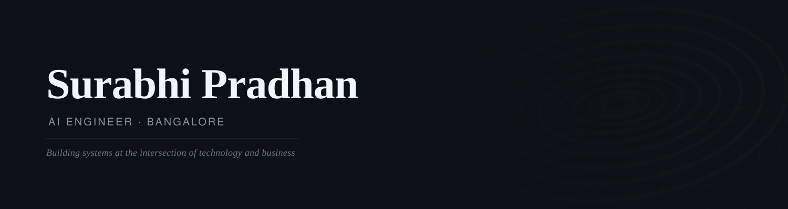

**AI Engineer · Builder · Bangalore**

[LinkedIn](https://www.linkedin.com/in/surabhi-pradhan/ &nbsp;·&nbsp; [GitHub](https://github.com/surpradhan)

---

I build systems at the intersection of language models and real-world utility — from evaluation frameworks and agent pipelines to tools that make AI actually work in production. Currently exploring agent memory, multi-agent orchestration, and the infra that makes large systems reliable.

---

## Work

**personal-mobile-orchestrator** &nbsp; · &nbsp; Python  
AI-powered orchestration layer for autonomous mobile automation. 146 commits and counting.

**claude-code-for-ai-engineers** &nbsp; · &nbsp; Python  
A methodology-first skill pack for AI engineers — covering RAG evaluation, agent debugging, MCP servers, paper reproduction, and benchmark reporting.

**agent-workflow-comparison** &nbsp; · &nbsp; Python  
A controlled benchmark of 10 AI agent workflow patterns — single-step through human-in-the-loop — evaluated across 25 tasks on success rate, answer quality, tool accuracy, latency, and token cost. Results are directly comparable.

**cartograph** &nbsp; · &nbsp; Python  
Intelligent mapping and data visualization.

---

## Stack

Python · TypeScript · JavaScript

LangChain · OpenAI · Anthropic Claude · Hugging Face

FastAPI · PostgreSQL · Docker

---

## Background

I work at the edge of what language models can reliably do — building the scaffolding, the evals, and the debugging tools that make the difference between a demo and a system. My interest is less in the models themselves and more in the engineering discipline around them.

559 contributions in the last year.

---

*Bangalore, India*
